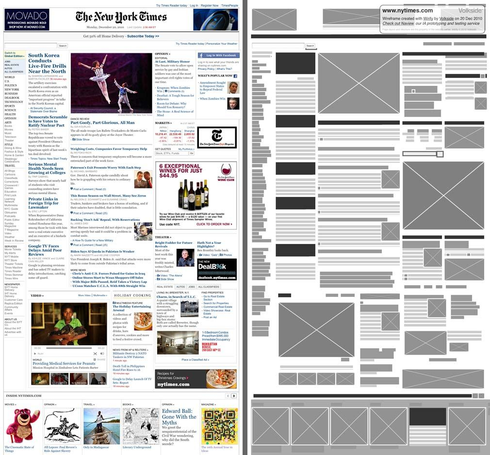
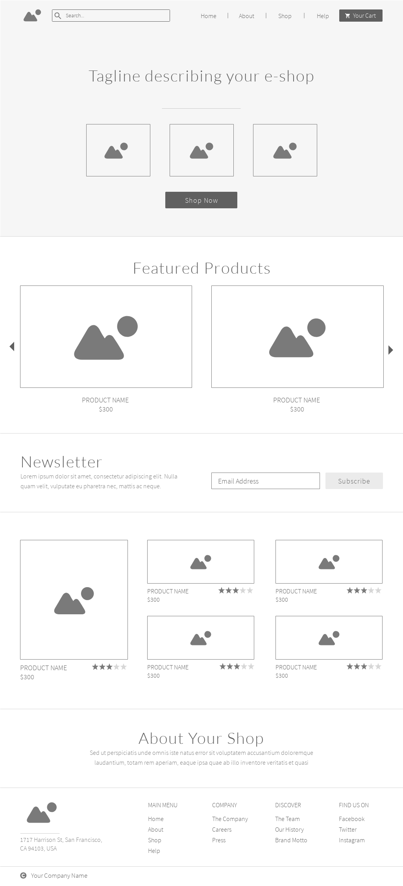

# P217_19.01.21_Html-Layout-1

1. **Create one of shown below screenshots:**

- First: 

    - 

- Second: 

    - 
    
    
2. **Read these articles:**

    - [Layout](https://www.w3schools.com/html/html_layout.asp)
    - [Display](https://www.w3schools.com/cssref/pr_class_display.asp)
    - [Float](https://www.w3schools.com/css/css_float.asp)
    - [Clearfix](https://www.w3schools.com/css/css_float_clear.asp)
    - [Examples](https://www.w3schools.com/css/css_float_examples.asp)
    
    
## Some usefull resources:

   - https://www.youtube.com/watch?v=2tC4PIlEz_o&ab_channel=SteveGriffith
